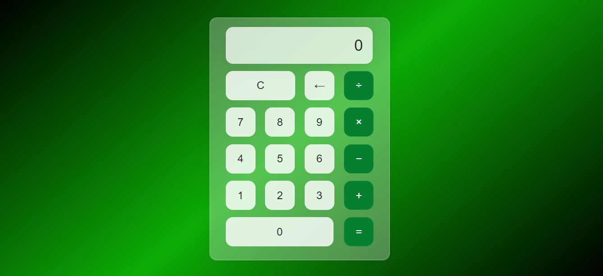

<h1 align="center"> Calculator </h1>

Projeto Calculadora   

  <a href="#-tecnologias">Tecnologias</a>&nbsp;&nbsp;&nbsp;|&nbsp;&nbsp;&nbsp;
  <a href="#-projeto">Projeto</a>&nbsp;&nbsp;&nbsp;|&nbsp;&nbsp;&nbsp;

  

  

 

  

## 🚀 Tecnologias

Esse projeto foi desenvolvido com as seguintes tecnologias:

- HTML e CSS
- JavaScript
- Git e Github

## 💻 Projeto

O PortTema é um agregador de links para usar como cartão de visitas online.

- [Acesse o projeto finalizado, online](https://github.com/DayvysonAlmeida/Calculator)

---

Feito com ♥ by DayFer : [Entre em contato](dayvysonalmeida@gmail.com)